# FLUFFY CLOUD RENDERING
Last summer I spend some time learning WebGPU, and build [a real-time physically-based renderer](https://github.com/rf1424/BaseWebGPU). 
Through my internship at Team Lab and procedural classes at school this year, I was exposed to a lot of computer graphics work involving rendering, shading, and proceduralism, and began loving them.

Building upon last year, I wanted to do something new with WebGPU and shaders - rendering real-time fluffy clouds in real-time. 


### Final Results 

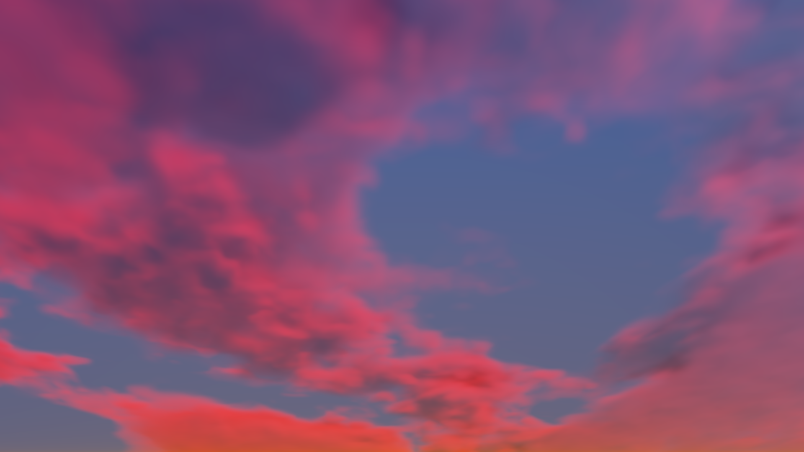

<p align="center">
  
  
  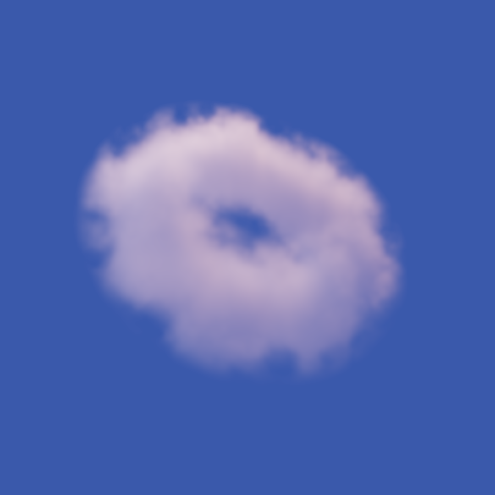
</p>

In order to render fluffy, physically based clouds in real time, I focused on three areas, which I will go over in order:


**0. [Physically-based volume rendering](#0-physically-based-volume-rendering)**
**1. [Procedural cloud shaping](#1-shaping-clouds-writeup-in-progress)**
**2. [Lookdev and Colors](#2-lookdev-and-colors-writeup-in-progress)**
**3. [Real-time performance optimizations](#3-optimizations)**


### 0. Physically Based Volume Rendering 

I learned from [several articles and papers](#references) to understand the physical basis and mathematical formulation of volumetric rendering.
At its core, volume rendering simulates how light accumulates as a ray travels through the volumetric medium. In ray marching, we approximate this by sampling the volume at discrete points along the ray and accumulating their contributions. 

##### Beer Lambert's Law 
As the ray travels through the volume, each sample is attenuated by the medium before reaching the camera. Transmittance T describes the fraction of light energy that remains unattenuated after traveling through the medium. Using the Beer Lambert law, we say: 

$T=e^{−{σ_t}\cdot​d}$ 

where T is the transmittance T, $σ_t$ is the extinction coefficient, and d is the distance traveled through the medium.
From this, for a single ray-marching step of length Δt, we can express the fraction of radiance attenuted at this step as: $α=1−e^{−{σ_t}\cdot​Δt}$. 
<details>
<summary>Code</summary>

```wgsl
colAccumulate(ray: Ray) -> vec3f {
    ...
    var col = vec3f(0.);  // Accumulating color
    var T: f32 = 1.0;    // Transmittance 
    var Li = vec3f(1.); // Sampled light color
    
    // Step through the volume and sample
    for (var i: i32 = 0; i < 40; i++) {
        ...
        let alpha = 1. - exp(-d_e * dt);
        col += alpha * T * Li;
        T *= (1. - alpha);
    }

    ...
    col += skyCol * T; // Background
    return col;
}
```

</details>

By sampling a constant light energy (a single color) and accounting only for transmittance, we can get something like this: 

<p align="center">
  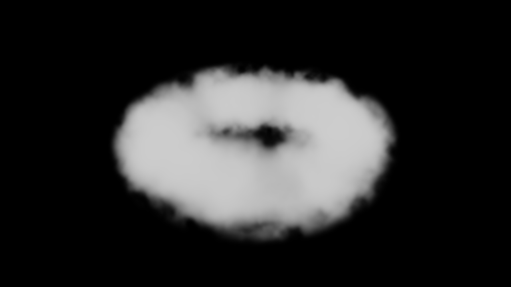
</p>


##### Scattering and Absorption, and Extinction Coefficients 
Note the extinction coefficient $\sigma_t$ in the Beer–Lambert law.
In clouds, extinction comes from two processes: scattering , which redirects light in other directions, and absorption, which removes light from the volume. Thus,
$\sigma_t = \sigma_s + \sigma_a$
where $\sigma_s$ is the scattering coefficient and $\sigma_a$ is the absorption coefficient. 

##### Light and Shadow 
To account for the attenuation of light before it reaches each cloud sample, I shoot a secondary ray from the sample toward the light direction.
Along this ray, I accumulate the optical depth through the density field and use the Beer–Lambert law to obtain the light transmittance.

```math
T_{\text{light}} = e^{-\int \sigma_t\,ds}
```

This accounts for self-shadowing of the volume. Denser regions attenuate more light, causing less light to reach samples deeper inside the cloud. Before and after the light attenuation:

<p align="center">
  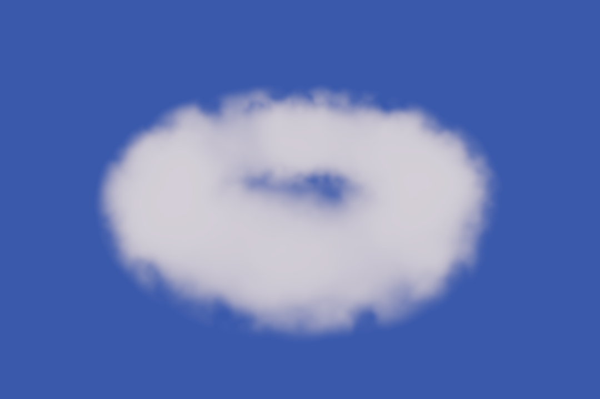
  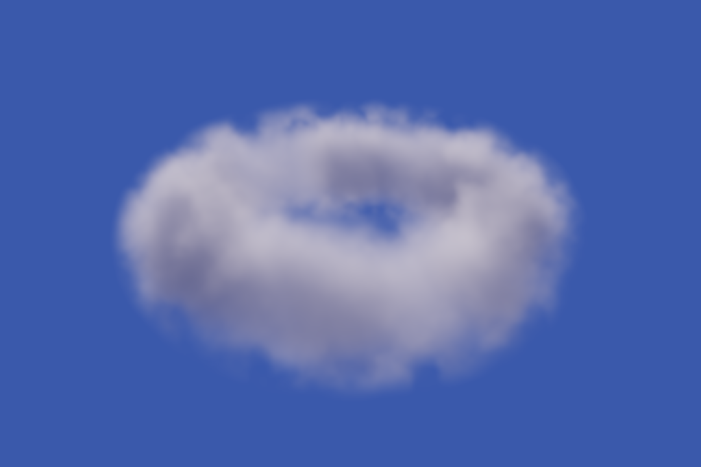
</p>

##### Henyey–Greenstein Phase Function
Scattering in clouds is anisotropic instead of  isotropic, meaning that the light is not scattered equally in all directions. I used the Henyey–Greenstein (HG) phase function to simulate this: $p(\omega_i,\omega_o)=\frac{1-g^2}{4\pi(1+g^2-2g\cos\theta)^{3/2}}$. 
The parameter $g$ controls the directionality of scattering. Below shows g = 0.1, g = 0.4, g = 0.7 from left to right with backwards lighting. 
<p align="center">
  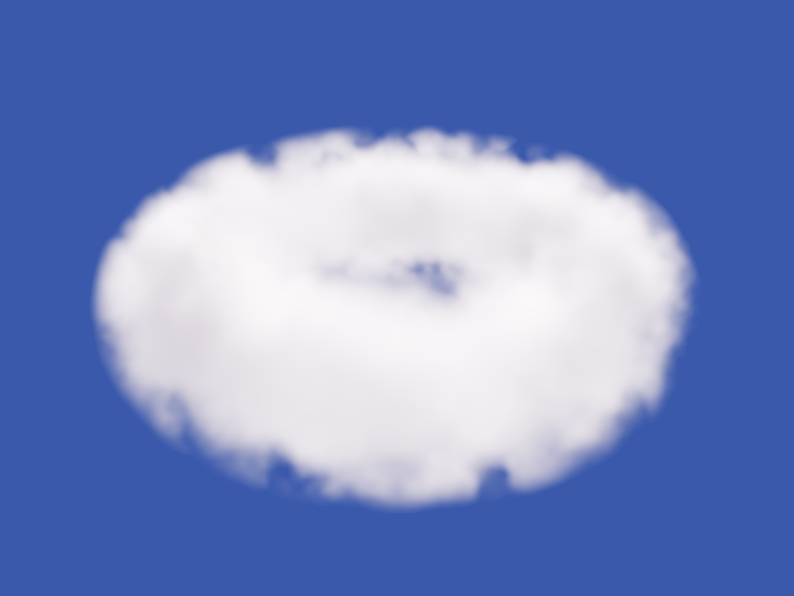
  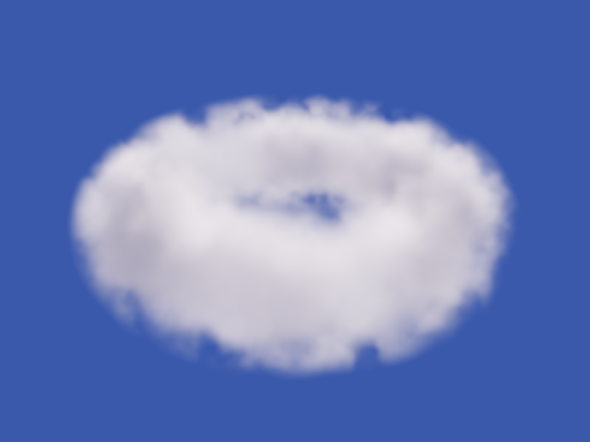
  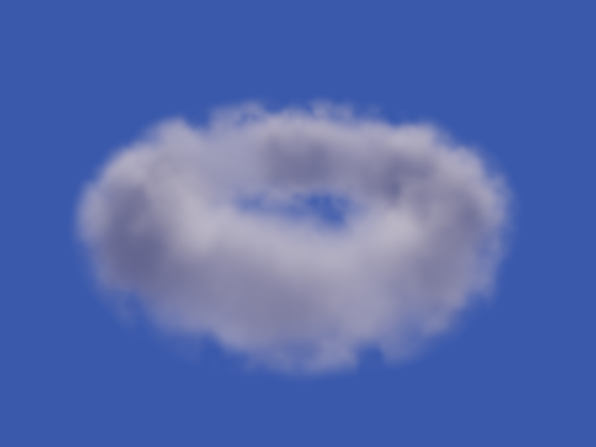
</p>
 
 Positive values produce forward scattering, while $g=0$ corresponds to isotropic scattering. 


##### The Volumetric Equation
Combining all these, the single-scattering contribution at each ray-marching sample is:

```math
\boxed{
\Delta C
=
T \cdot 
\frac{d_s}{d_t}
\alpha \cdot 
L_i \cdot f
}

```
where:

- $T$ : transmittance. 
- $\alpha$ : the fraction of incoming light removed at the current sample, written as $1-e^{-d_t\Delta t}$. 
- $d_s$ : scattering coefficient. 
- $d_t$ : extinction coefficient. $d_t=d_s+d_a$
- $L_i$ : radiance/light energy at the sample. 
- $f$ : phase function.  

Note that at each sample, light is both scattered out of the ray and scattered in from other directions (out-scattering and in-scattering). Of the energy removed from the ray, represented by $\alpha$, the fraction $\frac{d_s}{d_s+d_a}=\frac{d_s}{d_t}$ is attributed to scattering rather than absorption. This ratio is called the single-scattering albedo. 


### 1. Shaping Clouds (***writeup in progress)

I define cloud shapes using a density field.

For simple, concrete shapes such as a donut-shaped cloud, I use an SDF to define the base shape, then distort its surface using FBM noise to introduce organic variation.

<p align="center">
  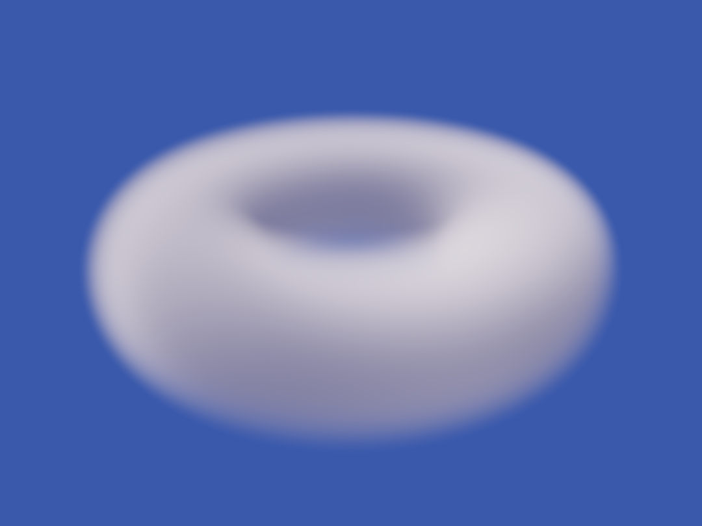
  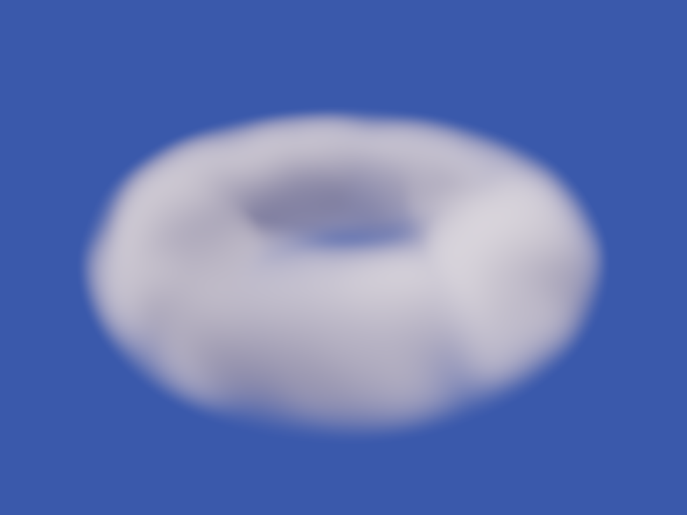
  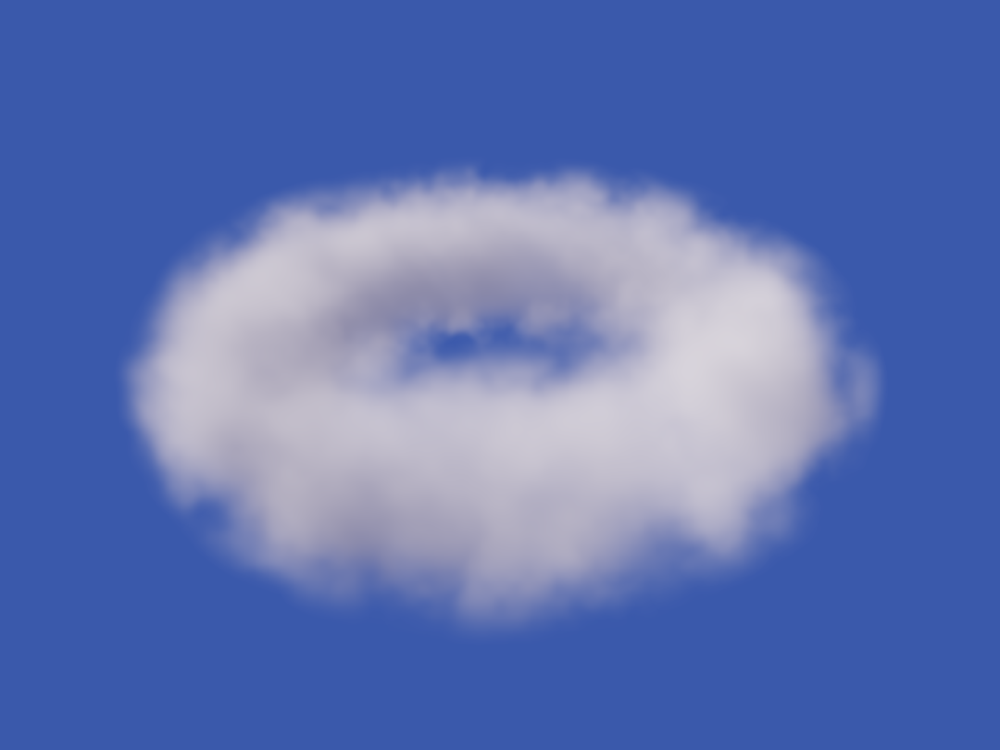
</p>
<!-- 

 -->

For larger sky clouds, I use two levels of noise: a low-frequency noise field to define the overall cloud shape, and a higher-frequency field to add finer details, particularly around the edges. 


| 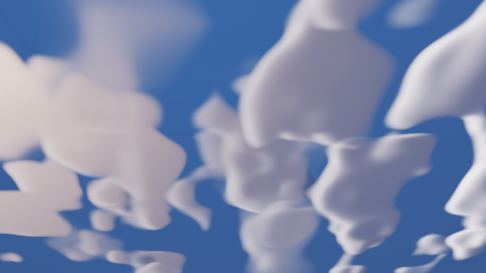 | 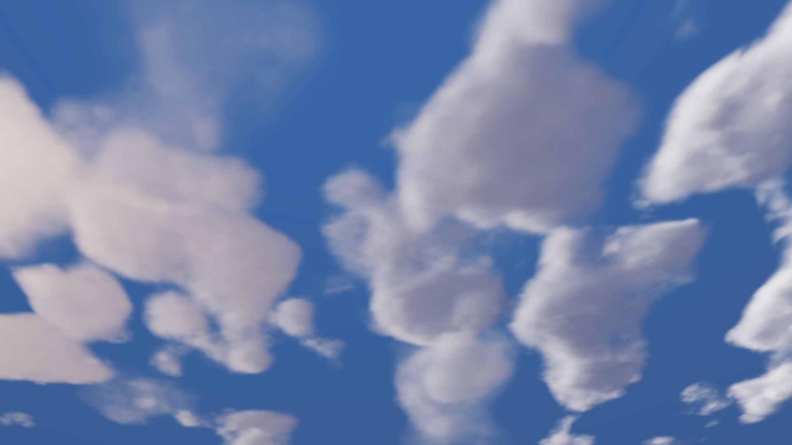 |
| :---: | :---: |
| Base low freq noise | Second high freq noise |

The second layer noise is only applied to the edge, or "shell" of the cloud volume, visualized below: 
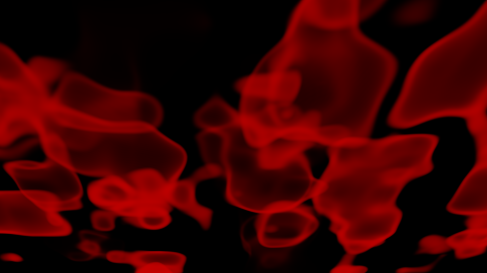


### 2. Lookdev and Colors (***writeup in progress)

**This is my facorite part.**
- Jittering to ease banding artifacts 
You can use this to your advantage actually. 
- Choosing colors procedurally.
- Ambient Factor. 


### 3. Optimizations

**Bounding box:** Sampling volume is expensive and doing so in empty space is wasteful. I use a simple SDF around the cloud volume to skip directly to near the cloud before starting the ray march.

**Skip low-density samples:** Samples with negligible density contribute very little, so they can be skipped:
 ```if (dens < 1e-2) continue;```

**Terminate Early:** Once the accumulated transmittance becomes sufficiently small, additional samples contribute negligibly and so I can terminate the ray march before reaching the original step count. 

**Step size:** Increasing the step size reduces the number of samples and improves performance, but can miss fine cloud details and introduce visible artifacts. Thus the step size needs to balance visual quality and performance. Jittering can help ease these banding artifacts, though. 


### Future improvements (***writeup in progress)

- Multi-scattering

### References 
[The Real-Time Volumetric Cloudscapes of Horizon Zero Dawn](https://www.guerrilla-games.com/read/the-real-time-volumetric-cloudscapes-of-horizon-zero-dawn)

[Introduction to Volume Rendering by Scratchpixel](https://www.scratchapixel.com/lessons/3d-basic-rendering/volume-rendering-for-developers/intro-volume-rendering.html)

[Forward Scattering by Nicholas Chapman](https://www.forwardscattering.org/)